# Rapport - Laboratoire 2

### Auteur Rafael Dousse

## Introduction

Le but de ce laboratoire est de se familiariser avec les signaux et les timers et les limites de Linux en tant que système temps réel. Pour cela, il faut découvrir et réecrire un programme qui va nous permetre d'envoyer un signal à intervalle régulier sur la FPGA et mesurer la précision de ces signaux.

## Partie 1 - Développement

Le programme qui nous est fourni récupère 30 mesures de temps et affiche les secondes et les microsecondes correspondantes. Après avoir réécrit le programme en y ajoutant une boucle pour imprimer les résultats, nous ne constatons pas de différence significative. La seule façon de détecter une différence est d'utiliser le programme summary qui nous a été fourni.

```Bash
---------------------------------------------- summary1.c -----
  Total of 30 values 
    Minimum  = 912.214676 (position = 0) 
    Maximum  = 912.216668 (position = 29) 
    Sum      = 27366.494752 
    Mean     = 912.216492 
    Variance = 0.000000 
    Std Dev  = 0.000344 
    CoV      = 0.000000 
---------------------------------------------------------------

```


```Bash
---------------------------------------------- summary1.c -----
  Total of 30 values 
    Minimum  = 912.227803 (position = 0) 
    Maximum  = 912.227970 (position = 29) 
    Sum      = 27366.836630 
    Mean     = 912.227888 
    Variance = 0.000000 
    Std Dev  = 0.000048 
    CoV      = 0.000000 
---------------------------------------------------------------

```
Il existe une différence entre les valeurs minimales et maximales, mais cela est normal étant donné que les valeurs sont différentes. En revanche, l'écart-type est plus petit dans le deuxième cas. Ainsi, le fait de stocker les valeurs dans un tableau et de les imprimer par la suite a un léger impact sur la précision. Cela pourrait être dû au fait que la fonction printf prend du temps pour effectuer des appels système, donc le stockage dans un tableau serait plus précis. Cependant, cela n'est pas certain car en principe, la fonction printf a un mécanisme de mise en tampon (buffering) et n'affiche le contenu du tampon qu'après, en effectuant le moins d'appels système possible. La granularité de la mesure est en microsecondes, ce qui est observable entre les changements de mesures ou simplement en consultant la page d'aide man.

### Partie 2 - POSIX

Ici, nous avons utilisé une bibliothèque différente qui nous permet d'accéder à différentes horloges. Dans ce cas, le choix a été fait d'utiliser CLOCK_REALTIME.

La man page indique:

```Bash
 All  implementations support the system‐wide real‐time clock, which is identified by CLOCK_REAL‐TIME.  Its time represents seconds and  since the Epoch.  When its time  is  changed, timers  for a relative interval are unaffected, but timers for an absolute point in time are af‐fected.
```

Ainsi, l'utilisation de clock_gettime() et clock_getres() avec CLOCK_REALTIME nous permet de mesurer le temps avec une précision de nanosecondes.


### Partie 3 - Développement : timers

Dans le code fourni, une structure et une fonction sigaction sont utilisées pour gérer les signaux et appeler les fonctions de gestion associées. Nous avons déclaré 'time_handler()' comme étant le gestionnaire pour le signal SIGVTALRM. Ainsi, la fonction sigaction appellera 'time_handler()' lorsqu'elle recevra le signal SIGVTALRM. Ensuite, un ensemble de valeurs de timer est initialisé pour un délai de 250 ms, qui est le temps jusqu'à la première expiration du timer, et de 250 ms, qui est le temps entre les expirations consécutives du timer après la première expiration. La fonction setitimer() est utilisée pour initialiser le timer. Elle prend en paramètre le type de timer (dans notre cas, un ITIMER_VIRTUAL), la structure contenant les valeurs de temps pour le timer, et une structure contenant les valeurs de temps pour le timer avant l'appel à setitimer().

### Partie 4 - Mesures

Pour les mesures, j'ai utilisé le programme summary1 qui nous a été fourni, ainsi que Python pour générer des boxplots et des histogrammes. J'ai donc effectué des mesures pour des durées de 250, 500, 1000 et 10000 microsecondes, avec 1000 mesures prises pour chaque durée. Pour chaque mesure, j'ai généré deux boxplots : un avec les valeurs aberrantes et un sans, afin de faciliter la visualisation. J'ai également créé un histogramme de fréquences.


- #### t250 us / 250000 ns:

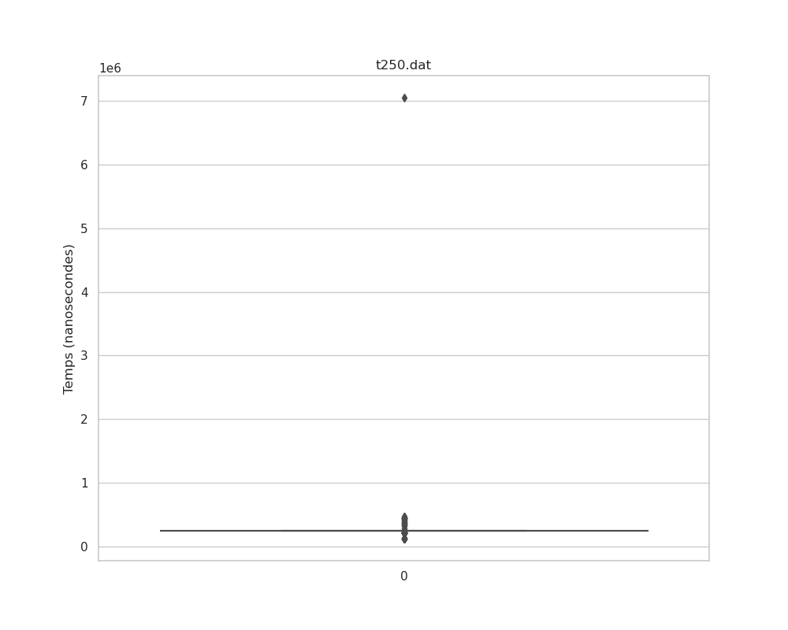
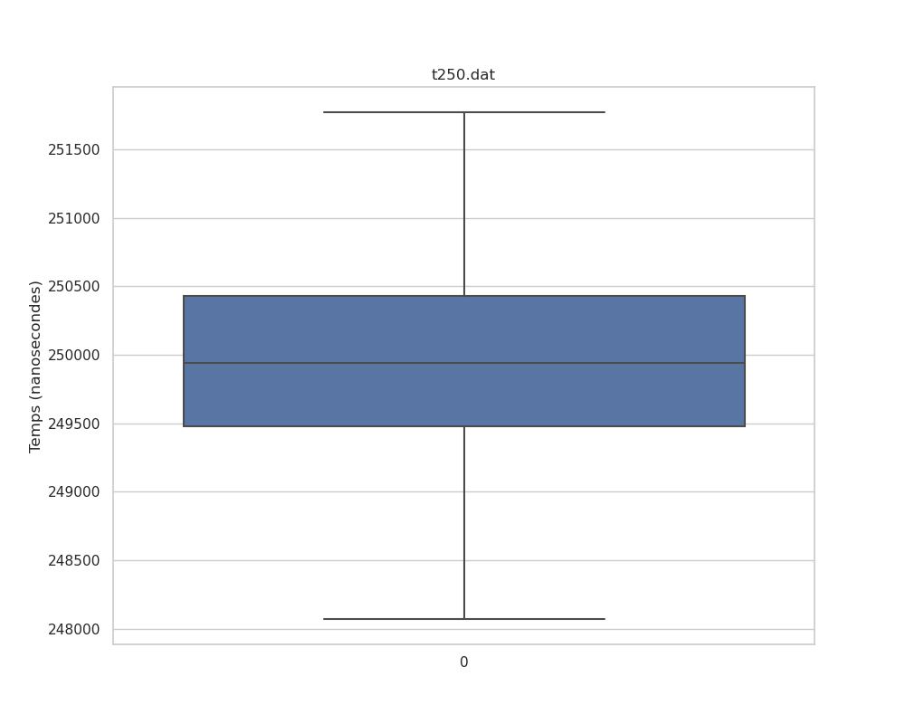

```Bash
---------------------------------------------- summary1.c -----
  Total of 1000 values 
    Minimum  = 122580.000000 (position = 595) 
    Maximum  = 7051380.000000 (position = 147) 
    Sum      = 259489580.000000 
    Mean     = 259489.580000 
    Variance = 47402730551.223412 
    Std Dev  = 217721.681399 
    CoV      = 0.839038 
---------------------------------------------------------------
```

- ####  t500 us / 500000 ns:

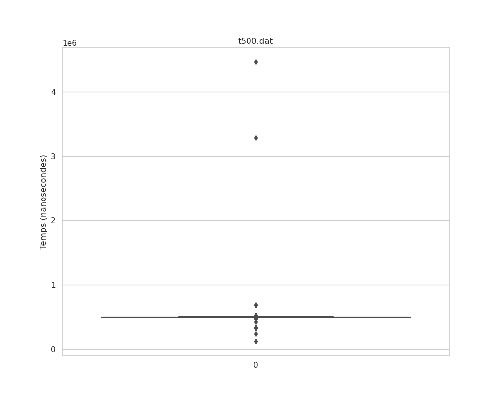
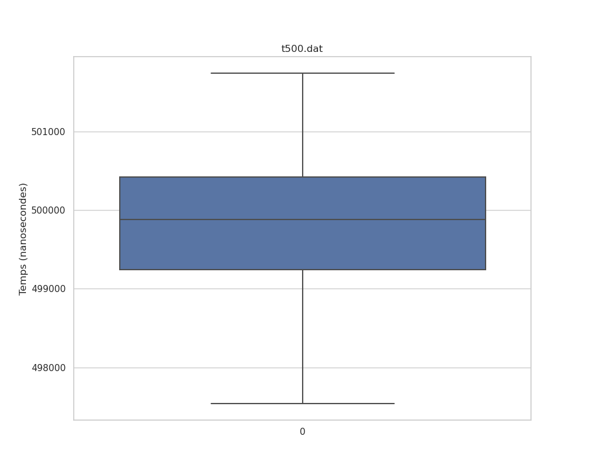

```Bash
---------------------------------------------- summary1.c -----
  Total of 1000 values 
    Minimum  = 125120.000000 (position = 13) 
    Maximum  = 4465750.000000 (position = 12) 
    Sum      = 505819560.000000 
    Mean     = 505819.560000 
    Variance = 23834926986.207062 
    Std Dev  = 154385.643718 
    CoV      = 0.305219 
---------------------------------------------------------------
```

- ####  t1000 [us] / 1000000 [ns]:

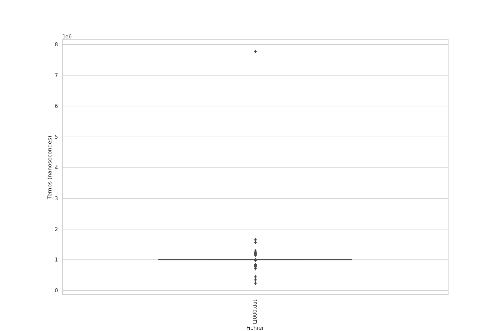
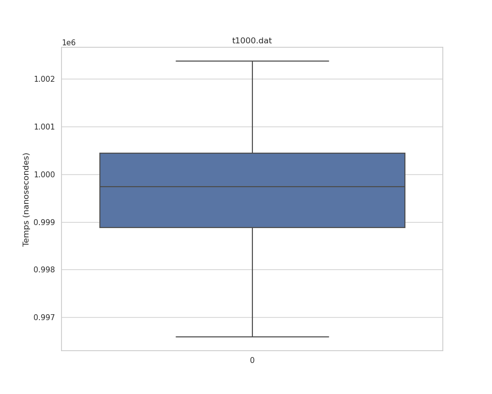

```Bash
---------------------------------------------- summary1.c -----
  Total of 1000 values 
    Minimum  = 241340.000000 (position = 242) 
    Maximum  = 7773740.000000 (position = 241) 
    Sum      = 1005828390.000000 
    Mean     = 1005828.390000 
    Variance = 53757405860.908081 
    Std Dev  = 231856.433728 
    CoV      = 0.230513 
---------------------------------------------------------------
```


- #### t10000 [us] / 10000000 [ns]:

*Pour une raison inconnue, le boxplot que me donne le programme python sans les outliers me donne une erreur, c'est à dire qu'il me donne des valeurs négatives avec une moyenne a 0 ce qui n'apparait pas pour le boxplot avec les outliers.* 

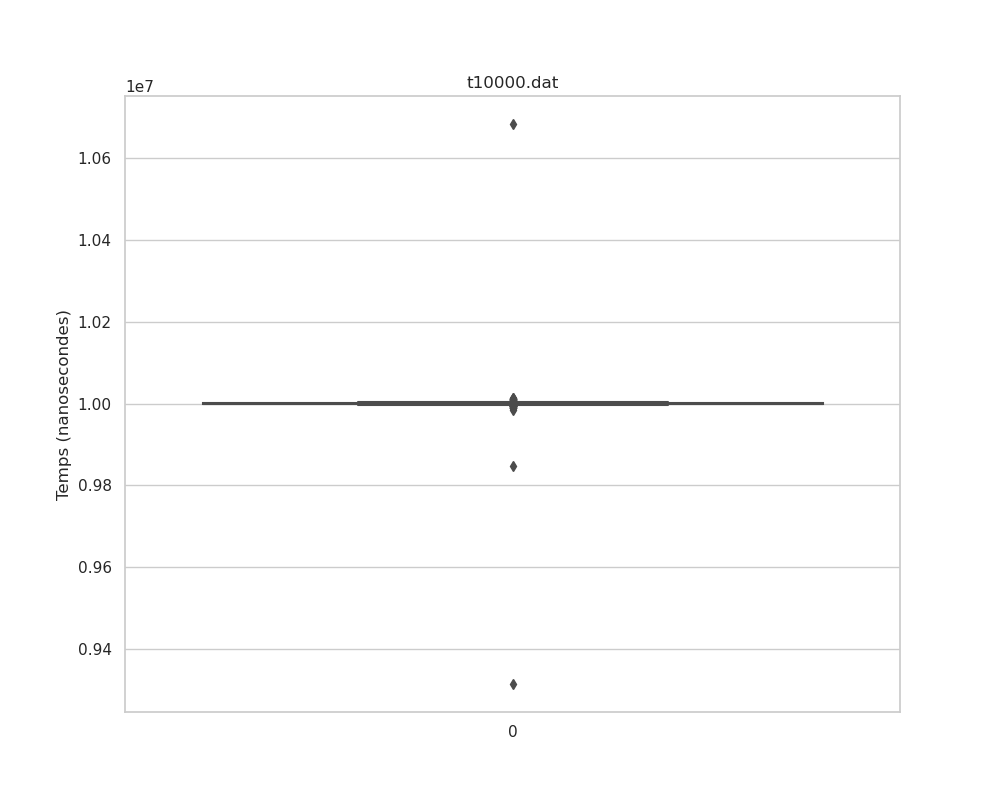
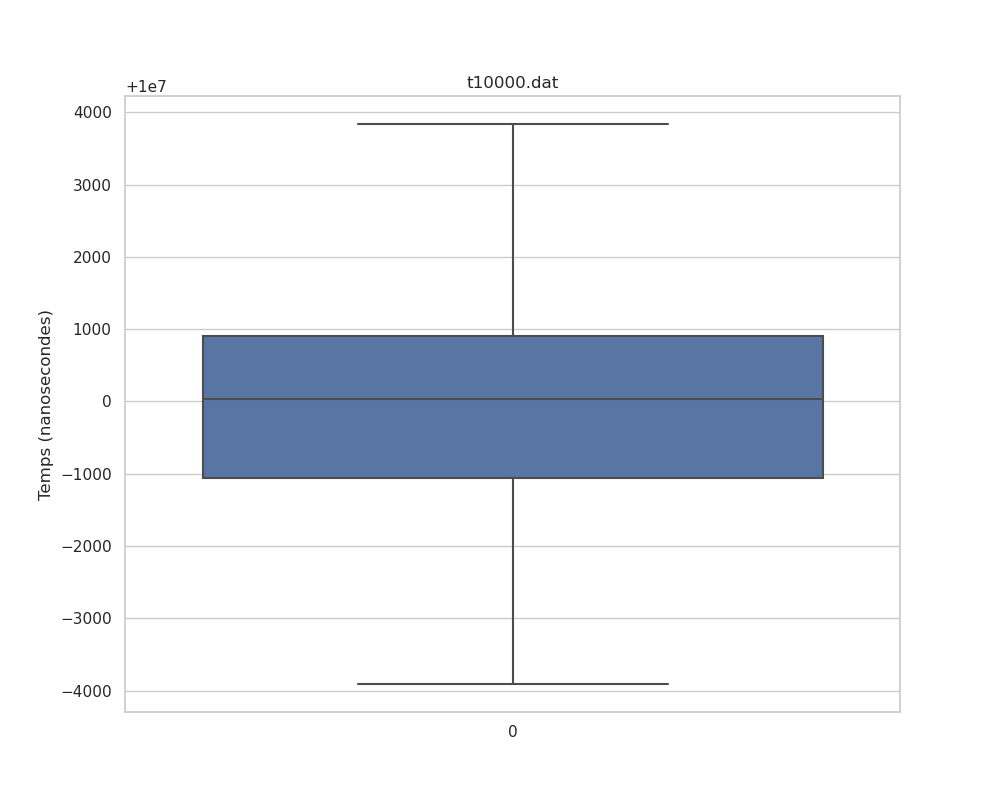

```Bash 
---------------------------------------------- summary1.c -----
  Total of 1000 values 
    Minimum  = 9313990.000000 (position = 2) 
    Maximum  = 10684250.000000 (position = 1) 
    Sum      = 9999837090.000000 
    Mean     = 9999837.090000 
    Variance = 967223052.343750 
    Std Dev  = 31100.209844 
    CoV      = 0.003110 
---------------------------------------------------------------
```

Pour la plupart des boxplots, les mesures montrent quelques outliers significatifs, probablement dus à des perturbations extérieures, telles que des processus concurrents ou des interruptions du système. Cependant, l'essentiel des données suggère une distribution proche de la normale, avec une moyenne à proximité de la valeur attendue, indiquant une certaine stabilité dans les mesures bien que des anomalies soient présentes.

Les résultats obtenus avec summary1 indiquent une variance assez élevée pour les intervalles plus courts, mais celle-ci diminue avec l'augmentation de l'intervalle de mesure, ce qui pourrait suggérer une meilleure fiabilité à des intervalles de 10 ms. Cela pourrait être attribuée à la gestion du timer par le système d'exploitation et aux spécificités techniques de la FPGA, qui pourraient être mieux adaptées à la gestion de durées plus longues et une fréquence de la clock qui pourrait ne pas gérer correctement des temps si court.

Les histogrammes confirment visuellement que les valeurs sont concentrées autour de la moyenne, ce qui corrobore l'idée d'une distribution des mesures s'alignant sur une courbe normale pour les trois premiers jeux de données. Cependant, l'histogramme pour t10000 montre des valeurs aberrantes et une médiane autour de zéro, ce qui est incohérent avec les valeurs observées. De nouveau, je ne comprends pas pourquoi ça m'affiche des valeurs négatives et une moyenne au tour de 0 alors que les résultats n'en contienne aucune.

---
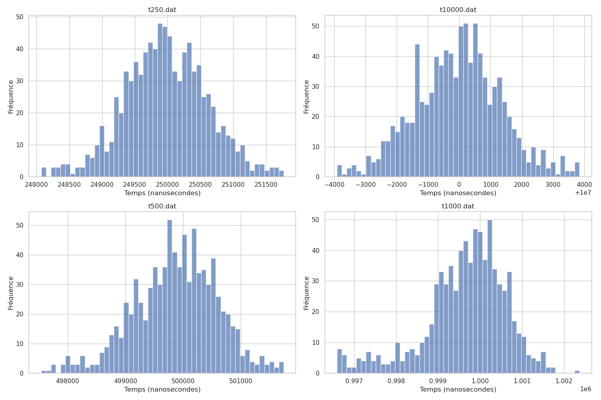

### Partie 5 - Perturbations

La suite des mesures ont été faites avec des intervalles de temps de 1ms et des perturbations.  Les perturbations comprenaient des ajustements de la priorité de processus (niceness) et l'exécution de tâches concurrentes ainsi qu'un ping. Les niveaux de niceness utilisés étaient de 19, 5, -10 et -20, et des mesures ont été prises simultanément avec l'exécution de programmes gourmands en CPU comme cpu_loop. Des tâches telles que htop, cpu_loop et gettimeofday2 ont également été exécutées en parallèle pour évaluer l'impact sur la performance. Et pour le ping je n'ai pas pu le faire en classe mais il a été fait depuis mon ordinateur sur la fpga et j'ai lancé les mesures en même temps.

Les boxplots révèlent que les variations de la priorité du processus n'ont pas significativement affecté les mesures par rapport au boxplot vert représentant la mesure de référence sans perturbation. Peut-être les appels système relatifs au temps peuvent être suffisamment protégés des variations de priorité, peut être grâce à la gestion de CLOCK_REALTIME par le système d'exploitation, ou que la consommation  du CPU par notre programme de mesure est si faible que même avec une priorité réduite, il va recevoir suffisamment de temps processeur pour maintenir sa précision.

En revanche, l'existence des outliers dans les scénarios avec cpu_loop (représentés par les boxplots orange), ainsi qu'une augmentation de la variabilité des mesures (illustrée par les
boîtes plus larges en bleu, orange et brun), indique un impact marqué des processus parallèles sur les résultats. Cela montre clairement comment des charges CPU concurrentes peuvent influencer la régularité et la précision des événements de timing.

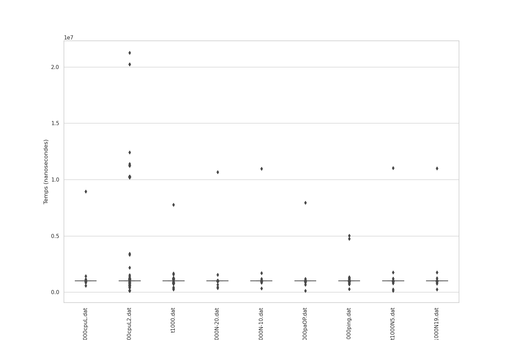
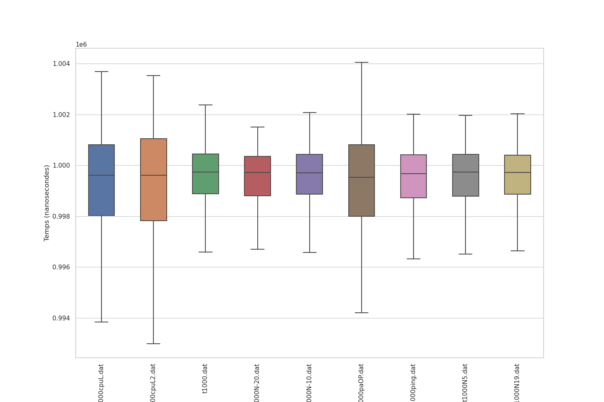

Les histogrammes confirment et complètent ces observations en illustrant la distribution des mesures de timing. Pour les scénarios sans perturbations significatives, les histogrammes présentent une distribution plus ou moins symétrique autour de la moyenne, suggérant une stabilité dans la capacité du système à générer des événements périodiques. Cependant, lorsqu'il y a des charges parallèles, la distribution s'élargit et les fréquences des outliers augmentent, indiquant une dispersion accrue des mesures.


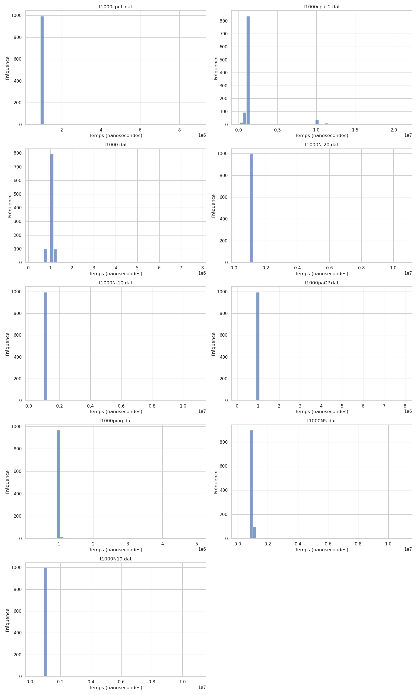
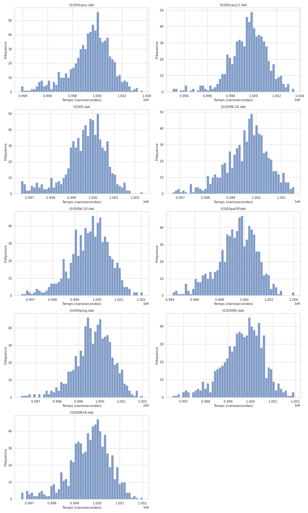

