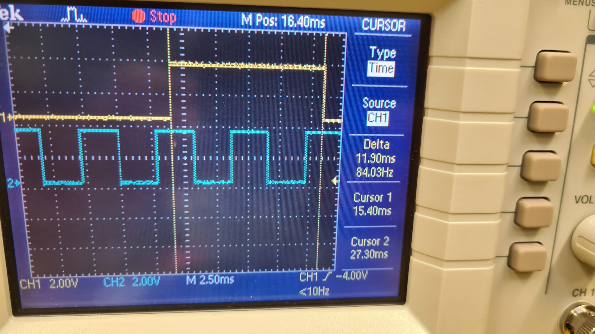

# Rapport - Laboratoire 3
### Auteur : Rafael Dousse

## Introduction 

Dans ce laboratoire, nous explorons les variations de performance entre trois approches de programmation en temps réel et standard. Premièrement, nous évaluons un programme basé sur un timer périodique CLOCK_REALTIME, suivi par un thread POSIX utilisant l'ordonnanceur Linux SCHED_FIFO avec une priorité élevée. Enfin, nous testons un thread temps réel sous Xenomai. L'objectif est de mesurer et de comparer l'efficacité de chaque méthode en utilisant également un oscilloscope, outil essentiel pour affiner nos mesures et améliorer notre compréhension pratique de ces technologies.

Les mesures de temps ont été effectué et sont indiquées dans ce rapport mais malheureusement, je n'ai pu prendre qu'une mesure à l'oscilloscope et je n'ai pas pu faire pour les autres programmes autre que `gpio_toggle`.

## Étape 1 : signal_timer2.c - Mesures de performance

### gpio_toggle

TODO: Revoir le texte
Le programme gpio_toggle.c utilise plusieurs fonctions pour contrôler les GPIOs sur un système embarqué. Il démarre par configurer un signal handler pour permettre une sortie propre du programme lors de l'interruption par l'utilisateur. Ensuite, il initialise les GPIOs pour écrire des valeurs alternées à intervalles réguliers (10 ms) en utilisant la fonction write_gpio_val(). Le programme mesure également le temps passé entre chaque toggle de GPIO pour surveiller la précision du timing. Il affiche ce temps en millisecondes. Cela permet de vérifier si le programme respecte bien l'intervalle de temps défini et de surveiller la performance du contrôle des GPIOs en temps réel.

On peut remarquer que le delta est de 11.9 ms entre l'écriture de high and low. On a mit 10ms et ça prends donc 1.8 ms pour l'écriture.

Le script fourni pour la gestion des GPIOs nous permet de nous familiariser avec l'écriture sur ces ports et d'utiliser un oscilloscope pour mesurer le temps écoulé entre chaque opération. Comme vu avec le delta de l'image il y a parfois des écarts entre le temps attendu plus grand que le temps réel. Ici, j'ai prit le soin de changé le code fournit et d'implémenter la mesure du temps que prend l'écriture d'une GPIO. En intégrant la mesure du temps d'écriture des GPIOs, on peut observer que cette opération prend en moyenne 1,5 ms, ce qui pourrait expliquer ces écarts. Lorsque le programme est exécuté sans activer les GPIOs, les mesures sont beaucoup plus proches des 10 ms attendus.

### Mesures 
| Mesures sans dohell et avec gpio  | Mesures sans dohell et sans gpio | 
| :-------------: |:-------------:|
GPIO 1.633 ms  | time 11.454 ms |
time 13.534 ms | time 10.730 ms |
GPIO 1.631 ms  | time 10.459 ms |
time 12.268 ms | time 10.457 ms |
GPIO 1.629 ms  | time 10.456 ms |
time 12.263 ms | time 10.457 ms |
GPIO 1.628 ms  | time 10.458 ms |
time 12.258 ms | time 10.457 ms |
GPIO 1.634 ms  | time 10.458 ms |
time 12.594 ms | time 10.454 ms |
GPIO 1.631 ms  | time 10.456 ms |
time 12.268 ms | time 10.457 ms |
GPIO 1.627 ms  | - |
time 12.257 ms | - |
GPIO 1.629 ms  | - |
time 12.256 ms | - |
GPIO 1.807 ms  | - |
time 12.262 ms | - |
GPIO 1.628 ms  | - |

### Signal_timer2

Dans ce programme, nous utilisons des timers pour générer des signaux périodiques, offrant une précision supérieure à celle du programme précédent grâce à l'utilisation de timers systèmes, qui sont des interruptions planifiées. Bien que le temps d'écriture des GPIOs reste similaire au programme antérieur, son impact sur la précision globale semble négligeable. Cette observation suggère que le système pourrait efficacement optimiser l'accès aux ressources matérielles comme les GPIOs, ou que la précision des timers noyau compense les petites latences introduites par ces opérations. Cependant, cette hypothèse nécessite une confirmation supplémentaire.

Lorsque le script dohell est exécuté simultanément, la précision des mesures se dégrade notablement, illustrant les limites des timers dans un environnement surchargé. Ce phénomène est attribuable au nombreux processus actifs qui interfèrent avec le timing précis des timers.

### Mesures 

| Mesures sans dohell et avec gpio  | Mesures sans dohell et sans gpio | Mesure avec dohell |
| :-------------: |:-------------:|:-------------:|
| Temps 10.013 ms | Temps 10.011 ms | Temps 89.247 ms
| Temps 9.993 ms | Temps 9.994 ms| Temps 1.832 ms
| Temps 10.001 ms | Temps 9.995 ms| Temps 78.844 ms
| Temps 9.999 ms | Temps 9.999 ms| Temps 3.247 ms
| Temps 10.001 ms | Temps 10.000 ms| Temps 40.377 ms
| Temps 9.997 ms | Temps 10.000 ms| Temps 55.708 ms
| Temps 10.014 ms | Temps 10.001 ms|Temps 2.832 ms 
| Temps 9.990 ms | Temps 9.999 ms| Temps 77.795 ms
| Temps 10.000 ms | Temps 10.001 ms| Temps 2.004 ms 
| Temps 9.999 ms | Temps 9.996 ms| Temps 57.347 ms
| Temps GPIO 1.841 ms | -| Temps GPIO 1.708 ms
| Temps GPIO 1.855 ms |-| Temps GPIO 1.618 ms
| Temps GPIO 1.772 ms |-| Temps GPIO 3.119 ms
| Temps GPIO 2.215 ms |-| Temps GPIO 1.583 ms
| Temps GPIO 1.776 ms |-| Temps GPIO 0.084 ms
| Temps GPIO 3.130 ms |-| Temps GPIO 2.706 ms
| Temps GPIO 1.804 ms |-| Temps GPIO 1.618 ms
| Temps GPIO 1.774 ms |-| Temps GPIO 1.738 ms
| Temps GPIO 1.803 ms |-| Temps GPIO 1.618 ms
| Temps GPIO 3.083 ms |-| Temps GPIO 1.712 ms

## Étape 3 : Tâches périodiques à haute priorité sous Linux

Ici, on utilise un thread POSIX à haute priorité avec la politique d'ordonnancement SCHED_FIFO pour simuler un environnement temps réel sous Linux. Cette configuration devrait permettre d'obtenir des mesures précises et stables, même lors de l'utilisation du script dohell. On remarque que l'écriture des GPIOs influence la précision, allongeant le temps d'exécution du programme comme durant le premier programme. 

Ce qui est plus surprenant, ce sont les temps d'exécution observés avec dohell qui sont bien plus élevés que prévu. Je m'attendais à des mesures plus précises et rapides en raison de la politique d'ordonnancement et de la priorité élevée mais ce n'est pas le cas. Je m'interroge sur la possibilité d'une erreur dans le code ou si cette observation est conforme aux attentes.

### Mesures 
| Mesures sans dohell et avec gpio  | Mesures sans dohell et sans gpio | Mesure avec dohell |
| ------------- |:-------------:|:-------------:|
Temps 0.006 ms |  Temps 10.689 ms |   Temps 0.007 ms |
Temps 12.054 ms | Temps 10.281 ms |  Temps 12.764 ms |
Temps 12.638 ms | Temps 10.291 ms |  Temps 12.118 ms |
Temps 15.564 ms | Temps 10.289 ms |  Temps 36.076 ms |
Temps 12.050 ms | Temps 10.277 ms |  Temps 22.823 ms |
Temps 12.229 ms | Temps 10.279 ms |  Temps 11.889 ms |
Temps 12.045 ms | Temps 10.274 ms |  Temps 12.172 ms |
Temps 12.054 ms | Temps 10.276 ms |  Temps 42.131 ms |
Temps 12.052 ms | Temps 10.278 ms | Temps 13.094 ms |
Temps 12.047 ms | Temps 10.378 ms | Temps 13.787 ms |
Temps GPIO 1.596 ms | -|  Temps GPIO 2.300 ms |
Temps GPIO 2.087 ms | -|  Temps GPIO 1.793 ms |
Temps GPIO 3.548 ms | -|  Temps GPIO 3.185 ms |
Temps GPIO 1.620 ms | -|  Temps GPIO 2.665 ms |
Temps GPIO 1.816 ms | -|  Temps GPIO 1.597 ms |
Temps GPIO 1.626 ms | -|  Temps GPIO 1.630 ms |
Temps GPIO 1.619 ms | -|  Temps GPIO 31.852 ms |
Temps GPIO 1.623 ms | -|  Temps GPIO 2.761 ms |
Temps GPIO 1.621 ms | -|  Temps GPIO 3.168 ms |
Temps GPIO 1.840 ms | -|  Temps GPIO 42.846 ms |

## Étape 4 : Threads Xenomai

Finalement, on a un troisième programme qui utilise Xenomai qui est un framework qui permet de développer des systèmes avec des capacités temps réel strictes sous Linux.
Pour répondre à la question sur mlockall(), voici un extrait de la man page de mlockall():

*mlock() et mlockall() verrouillent respectivement une partie et l'ensemble de l'espace d'adressage du processus appelant dans la mémoire physique, pour empêcher cette mémoire d'être évincée dans l'espace d'échange (swap). (...)
Les applications temps réel réclament un comportement temporel déterministe, et la pagination est, avec l'ordonnancement, une cause majeure de délais imprévus. (...)
Les processus temps-réel utilisant mlockall() pour éviter les délais dus à la pagination doivent réserver assez de pages verrouillées pour la pile avant d'entrer dans la section temporellement critique, afin qu'aucun défaut de page ne survienne lors d'un appel de fonction.*

Par rapport au fonctions utilisées dans le code, voici quelques explication:
- rt_task_create() et rt_task_start(): Ces fonctions sont utilisées pour créer et démarrer une tâche Xenomai. `rt_task_create` prépare la structure de la tâche et définit ses paramètres, tandis que `rt_task_start` active la tâche pour qu'elle commence à s'exécuter.
- rt_task_set_periodic() et rt_task_wait_period(): `rt_task_set_periodic` configure la tâche pour qu'elle s'exécute à des intervalles réguliers, et `rt_task_wait_period` est utilisée dans la boucle de la tâche pour attendre le prochain intervalle.
- rt_printf(): C'est une fonction similaire à printf mais adaptée pour les systèmes temps réel où l'utilisation standard de printf pourrait introduire des latences dues à l'accès aux ressources du système d'exploitation (donc les syscall)
-rt_join(): Elle permet de synchroniser la fin d'une tâche avec le thread principal, qui est le main dans notre cas.

Les résultats des mesures montrent que le programme Xenomai est le plus précis et stable des trois, même en présence de dohell. Les temps d'exécution restent constants et proches de la valeur attendue, ce qui montre l'efficacité de Xenomai pour les applications temps réel. Xenomai prends le meilleurs des timers et de la priorité élevée des tâches qui permet une grande précision des tâches en temps réel. On remarque aussi que Xenomai permet une écriture plus rapide aux GPIOs et donc ça n'influence plus autant le temps d'exécution du programme.

### Mesures 

| Mesures sans dohell et avec gpio  | Mesures sans dohell et sans gpio | Mesure avec dohell |
| ------------- |:-------------:|:-------------:|
Temps 10.032 |  Temps 10.031 | Temps 10.043 | 
Temps 9.998 |  Temps 9.997 | Temps 10.000 | 
Temps 9.997 |  Temps 10.003 | Temps 10.005 | 
Temps 10.006 |  Temps 9.997 | Temps 10.017 | 
Temps 9.995 |  Temps 10.002 | Temps 9.981 | 
Temps 9.999 |  Temps 10.000 | Temps 9.999 | 
Temps 10.001 |  Temps 10.005 | Temps 9.999 | 
Temps 10.000 |  Temps 9.991 | Temps 10.002 | 
Temps 10.000 |  Temps 10.001 | Temps 10.001 | 
Temps 10.010 |  Temps 10.007 | Temps 9.996 | 
Temps GPIO 0.002  |  - | Temps GPIO 0.002 | 
Temps GPIO 0.002 |  - | Temps GPIO 0.002 | 
Temps GPIO 0.002 |  - | Temps GPIO 0.002 | 
Temps GPIO 0.002 |  - | Temps GPIO 0.004 | 
Temps GPIO 0.002 |  - | Temps GPIO 0.003 | 
Temps GPIO 0.002 |  - | Temps GPIO 0.002 | 
Temps GPIO 0.002 |  - | Temps GPIO 0.002 | 
Temps GPIO 0.002 |  - | Temps GPIO 0.002 | 
Temps GPIO 0.002 |  - | Temps GPIO 0.003 | 
Temps GPIO 0.002 |  - | Temps GPIO 0.003 | 

## Conclusion

Dans ce laboratoire, plusieurs approches ont été utilisées pour mesurer la précision de l'exécution des tâches périodiques. Les tests ont montré que l'implémentation avec Xenomai offre une meilleure stabilité et précision, même sous charge du scripte `dohell`, grâce à son architecture optimisée pour les systèmes temps réel que les approches plus "basique" de Linux qui sont très bien mais pas suffisant pour des tâches en temps réel.

Précision sur le rapport: Les résultats, les idées et les discussions sont faite par moi mais le texte a été reformulé par chatgpt.